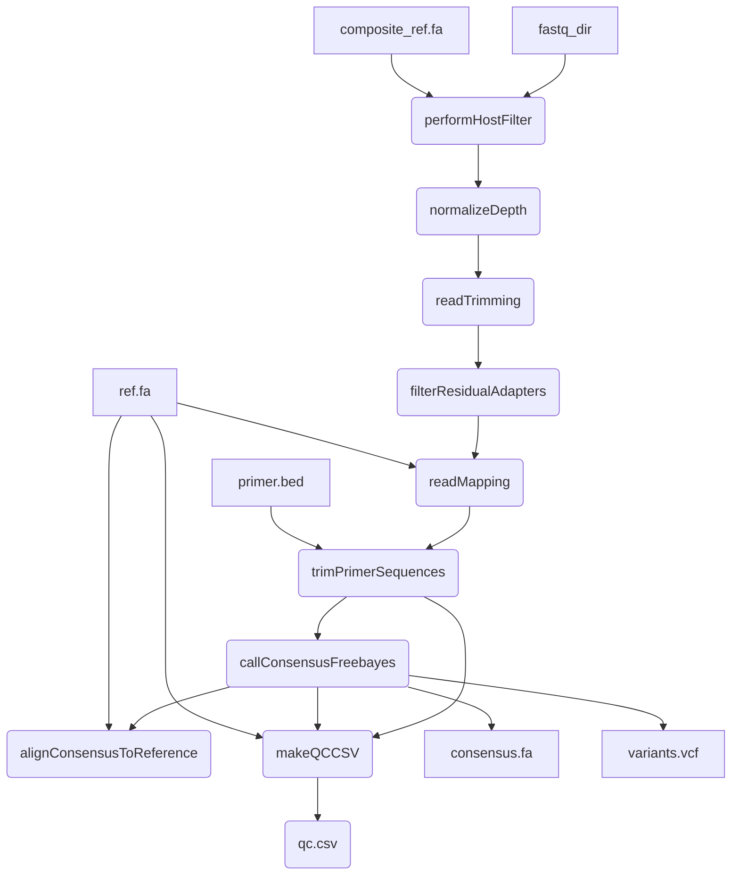

# mpxv-artic-nf
A Nextflow pipeline for running the ARTIC network's fieldbioinformatics tools (https://github.com/artic-network/fieldbioinformatics), with a focus on monkeypox virus (mpxv).


#### Introduction

This pipeline is based on the [BCCDC-PHL/ncov2019-artic-nf](https://github.com/BCCDC-PHL/ncov2019-artic-nf) pipeline, which is a fork of the [connor-lab/ncov2019-artic-nf](https://github.com/connor-lab/ncov2019-artic-nf) pipeline. It has been modified to support analysis of monkeypox virus.



#### Quick-start

```
nextflow run BCCDC-PHL/mpxv-artic-nf -profile conda \
  --prefix "output_file_prefix" \
  --bed /path/to/primers.bed \
  --ref /path/to/ref.fa \
  --primer_pairs_tsv /path/to/primer_pairs_tsv \
  --composite_ref /path/to/human_and_mpxv_composite_ref \
  --directory /path/to/reads \
  --outdir /path/to/outputs
```


#### Installation
An up-to-date version of Nextflow is required because the pipeline is written in DSL2. Following the instructions at https://www.nextflow.io/ to download and install Nextflow should get you a recent-enough version. 


#### Conda
The repo contains a environment.yml files which automatically build the correct conda env if `-profile conda` is specifed in the command. Although you'll need `conda` installed, this is probably the easiest way to run this pipeline.

--cache /some/dir can be specified to have a fixed, shared location to store the conda build for use by multiple runs of the workflow.

#### Config
Common configuration options are set in `conf/base.config`. Workflow specific configuration options are set in `conf/illumina.config` They are described and set to sensible defaults (as suggested in the [nCoV-2019 novel coronavirus bioinformatics protocol](https://artic.network/ncov-2019/ncov2019-bioinformatics-sop.html "nCoV-2019 novel coronavirus bioinformatics protocol"))

Important config options are:

| Option                           | Default  | Description                                                                                                         |
|:---------------------------------|---------:|--------------------------------------------------------------------------------------------------------------------:|
| `normalizationTargetDepth`       | `200`    | Target depth of coverage to normalize to prior to alignment                                                         |
| `normalizationMinDepth`          | `5`      | Minimum depth of coverage to normalize to prior to alignment                                                        |
| `illuminaKeepLen`                | `50`     | Length of illumina reads to keep after primer trimming                                                              |
| `illuminaQualThreshold`          | `20`     | Sliding window quality threshold for keeping reads after primer trimming (illumina)                                 |
| `varMinFreqThreshold`            | `0.25`   | Allele frequency threshold for ambiguous variant                                                                    |
| `varFreqThreshold`               | `0.75`   | Allele frequency threshold for unambiguous variant                                                                  |
| `varMinDepth`                    | `10`     | Minimum coverage depth to call variant                                                                              |


#### QC
A script to do some basic QC is provided in `bin/qc.py`. This currently tests if >50% of reference bases are covered by >10 reads (Illumina) or >20 reads (Nanopore), OR if there is a stretch of more than 10 Kb of sequence without N - setting qc_pass in `<outdir>/<prefix>.qc.csv` to TRUE. `bin/qc.py` can be extended to incorporate any QC test, as long as the script outputs a csv file a "qc_pass" last column, with samples TRUE or FALSE.

#### Output
A subdirectory for each process in the workflow is created in `--outdir`. A `nml_upload` subdirectory containing dehosted fastq files and consensus sequences is included. 
