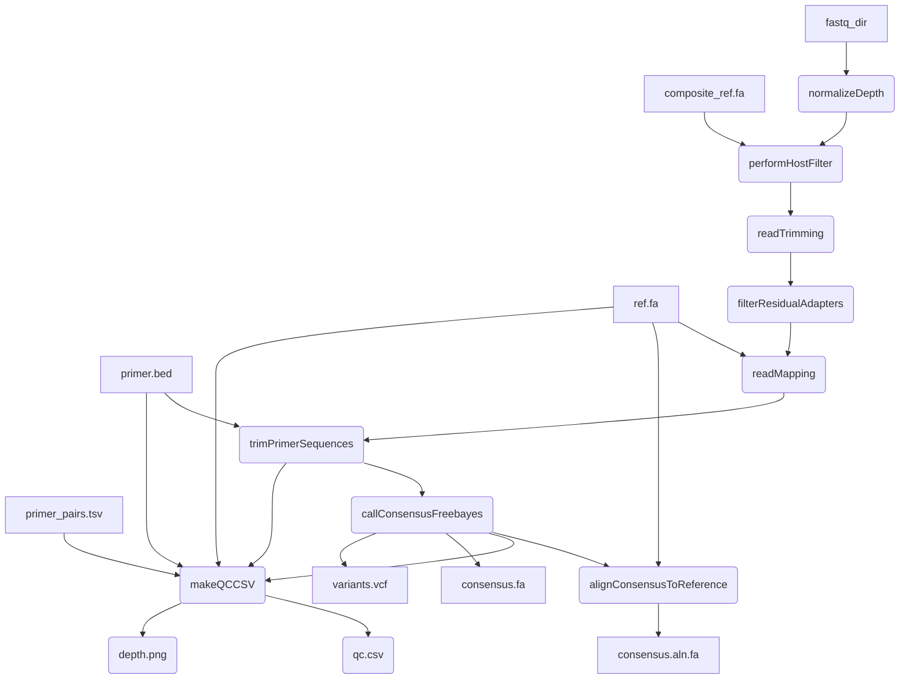

# mpxv-artic-nf
A Nextflow pipeline for running the ARTIC network's fieldbioinformatics tools (https://github.com/artic-network/fieldbioinformatics), with a focus on monkeypox virus (mpxv).


#### Introduction

This pipeline is based on the [BCCDC-PHL/ncov2019-artic-nf](https://github.com/BCCDC-PHL/ncov2019-artic-nf) pipeline, which is a fork of the [connor-lab/ncov2019-artic-nf](https://github.com/connor-lab/ncov2019-artic-nf) pipeline. It also includes freebayes-based variant calling and additional QC filters, initially introduced in [jts/ncov2019-artic-nf](https://github.com/jts/ncov2019-artic-nf). It has been modified to support analysis of monkeypox virus.



#### Quick-start

```
nextflow run BCCDC-PHL/mpxv-artic-nf -profile conda \
  --prefix "output_file_prefix" \
  --bed /path/to/primers.bed \
  --ref /path/to/ref.fa \
  --primer_pairs_tsv /path/to/primer_pairs_tsv \
  --composite_ref /path/to/human_and_mpxv_composite_ref \
  --directory /path/to/reads \
  --outdir /path/to/outputs
```


#### Installation
An up-to-date version of Nextflow is required because the pipeline is written in DSL2. Following the instructions at https://www.nextflow.io/ to download and install Nextflow should get you a recent-enough version. 


#### Conda
The repo contains a environment.yml files which automatically build the correct conda env if `-profile conda` is specifed in the command. Although you'll need `conda` installed, this is probably the easiest way to run this pipeline.

--cache /some/dir can be specified to have a fixed, shared location to store the conda build for use by multiple runs of the workflow.

#### Config

Important config options are:

| Option                           | Default  | Description                                                                                                         |
|:---------------------------------|---------:|--------------------------------------------------------------------------------------------------------------------:|
| `normalizationTargetDepth`       | `200`    | Target depth of coverage to normalize to prior to alignment                                                         |
| `normalizationMinDepth`          | `5`      | Minimum depth of coverage to normalize to prior to alignment                                                        |
| `keepLen`                        | `50`     | Length of reads to keep after primer trimming                                                                       |
| `qualThreshold`                  | `20`     | Sliding window quality threshold for keeping reads after primer trimming                                            |
| `varMinFreqThreshold`            | `0.25`   | Allele frequency threshold for ambiguous variant                                                                    |
| `varFreqThreshold`               | `0.75`   | Allele frequency threshold for unambiguous variant                                                                  |
| `varMinDepth`                    | `10`     | Minimum coverage depth to call variant                                                                              |

### Depth Normalization
By default, sequence depth will be normalized using `bbnorm` to the value specified by the `--normalizationTargetDepth` param (default: 200). To skip depth normalization, add the `--skip_normalize_depth` flag.

#### QC
A script to do some basic QC is provided in `bin/qc.py`. It measures the % of reference bases are covered by `varMinDepth`, and the longest stretch of consensus sequence with no `N` bases. This script does not make a QC pass/fail call.

#### Output
A subdirectory for each process in the workflow is created in `--outdir`. A `nml_upload` subdirectory containing dehosted fastq files and consensus sequences is included. 

#### Provenance
In the output directory for each sample, a provenance file will be written with the following format:
```
- process_name: performHostFilter
  tools:
    - tool_name: bwa
      tool_version: 0.7.17-r1188
      subcommand: mem
      parameters:
        - parameter: -t
          value: 8
    - tool_name: samtools
      tool_version: 1.10
      subcommand: sort
- process_name: readTrimming
  tools:
    - tool_name: trim_galore
      tool_version: 0.6.4_dev
- process_name: filterResidualAdapters
  tools:
    - tool_name: filter_residual_adapters.py
      sha256: c3d062687abf2bbec48721a562ec609742101eec82887b1f31b9997361da901e
- process_name: trimPrimerSequences
  tools:
    - tool_name: samtools
      tool_version: 1.10
      subcommand: view
      parameters:
        - parameter: -F
          value: 4
    - tool_name: samtools
      tool_version: 1.10
      subcommand: index
    - tool_name: samtools
      tool_version: 1.10
      subcommand: sort
    - tool_name: ivar
      tool_version: 1.3.1
      subcommand: trim
      parameters:
        - parameter: -e
          value: null
        - parameter: -m
          value: 50
        - parameter: -q
          value: 20
- process_name: callConsensusFreebayes
  tools:
    - tool_name: freebayes
      tool_version: v1.3.2-dirty
      parameters:
        - parameter: -p
          value: 1
        - parameter: -f
          value: ref.fa
        - parameter: -F
          value: 0.2
        - parameter: -C
          value: 1
        - parameter: --pooled-continuous
          value: null
        - parameter: min-coverage
          value: 10
        - parameter: --gvcf
          value: null
        - parameter: --gvcf-dont-use-chunk
          value: true
    - tool_name: bcftools
      tool_version: 1.10.2
      parameters:
        - parameter: norm
        - parameter: consensus
- input_filename: sample_R1.fastq.gz
  file_type: fastq-input
  sha256: 1411f944271b07918cf08393ab102d7760a811fb5b0df12ace104c95bb6ab341
- input_filename: sample_R2.fastq.gz
  file_type: fastq-input
  sha256: 0693d7e519b2e2a294d9d4a79ddfc3830137363b2c8bf9990fc392800a1ca11f
- pipeline_name: BCCDC-PHL/mpxv-artic-nf
  pipeline_version: 0.1.2
  timestamp_analysis_start: 2024-10-28T15:44:15.656920-07:00

```
